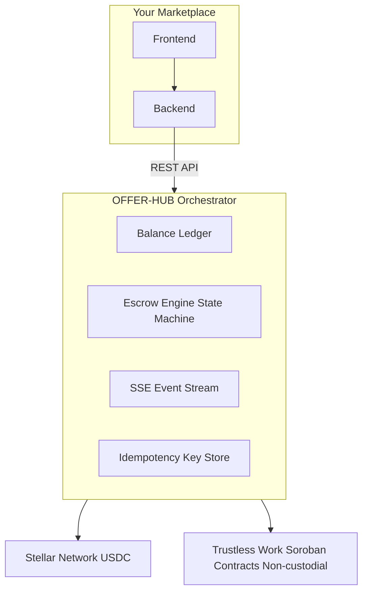

The Orchestrator is the central engine of OFFER-HUB. It coordinates every step of a transaction — from the moment a buyer deposits USDC to the moment a seller withdraws funds — enforcing rules, managing state, and communicating with the Stellar blockchain so your marketplace never has to.

<Callout type="tip">
  This guide covers the internal architecture. If you just want to make your first API call, go to [Quick Start](/docs/guide/quick-start) instead.
</Callout>

## What is the Orchestrator

The Orchestrator is a state machine-driven backend service that sits between your marketplace and the Stellar blockchain. It is responsible for:

- Managing buyer and seller **internal balances**
- Locking funds into **Soroban smart contracts** via Trustless Work
- Enforcing valid **escrow state transitions**
- Emitting **real-time events** on every state change
- Handling **dispute resolution** and **refund flows**

Your marketplace communicates with the Orchestrator via REST API. The Orchestrator handles everything on-chain.

<Callout type="note">
  The Orchestrator is intentionally narrow in scope. It handles payments, escrow, and balances. Authentication, listings, and communication are your marketplace's responsibility.
</Callout>

## API and background jobs

The API in `apps/api` serves the REST API and processes BullMQ background jobs in the same service.
The separate `apps/worker` package is deprecated; do not deploy it as a second required process.

## Architecture Overview



Marketplace requests enter the Orchestrator, which coordinates ledger, escrow, events, and idempotency work.

This view is verified against `apps/api/src/modules/orders/orders.controller.ts`, its `dto/create-order.dto.ts`, and `apps/api/src/modules/events/event-catalog.ts` in the Orchestrator repository; those files define the REST boundary, order input, and emitted domain events represented here.

### Key Components

**Balance Ledger** — tracks `available` and `reserved` balances for every user. All operations are atomic to prevent double-spending.

**Escrow Engine** — manages the lifecycle of each escrow from creation to settlement or dispute, enforcing valid state transitions.

**SSE Event Stream** — emits a domain event on every state change so your marketplace can react in real time.

**Idempotency Key Store** — caches responses to prevent duplicate operations when requests are retried.

## How it Processes Transactions

Every transaction follows the same linear flow:

### 1. Buyer Deposits

The buyer sends USDC to their assigned Stellar address. The Orchestrator detects the on-chain payment and credits the buyer's `available` balance.

### 2. Order Created

The buyer places an order. Funds move from `available` to `reserved` in the internal ledger — no longer spendable but not yet on-chain.

```
const order = await client.orders.create({
  buyer_id: "usr_123",
  seller_id: "usr_456",
  amount: "75.00",
  idempotency_key: "550e8400-e29b-41d4-a716-446655440004",
})
```

### 3. Escrow Funded On-Chain

The Orchestrator signs and submits a Stellar transaction that locks the USDC into a Soroban smart contract via Trustless Work. The escrow state moves to `FUNDED`.

<Callout type="note">
  At this point funds are held by the smart contract — not by OFFER-HUB. The Orchestrator cannot unilaterally move them. Only valid contract calls can release, dispute, or refund.
</Callout>

### 4. Work is Delivered

Your marketplace manages communication, deliverables, and reviews. The Orchestrator waits.

### 5. Settlement

The buyer approves the delivery. The Orchestrator submits transactions to release USDC from the smart contract to the seller's Stellar address.

```ts
const release = await client.orders.release('ord_789', 'Work approved');
```

### 6. Seller Withdraws

The seller requests a withdrawal. The Orchestrator signs a Stellar payment transaction sending USDC to any Stellar address.

<CommandLine>POST /api/withdrawals</CommandLine>

## State Machines

The Orchestrator runs six state machines, one per domain: **Order** and **Escrow** are drawn in full below, and **Milestone**, **Dispute**, **Top-up**, and **Withdrawal** are each documented — diagram, valid transitions, and the errors their guards raise — on their own page. Every machine reads its states from `packages/shared/src/enums/` and rejects a transition outside the table with the shared invalid-transition error, surfaced as `INVALID_STATE` (or a more specific member of that family). The Order and Escrow diagrams match `docs/architecture/state-machines.md` in the orchestrator repository exactly.

| Machine | States | Guard source | Documented in |
|---------|--------|--------------|---------------|
| [Order](#order-state-machine) | `OrderStatus` | `apps/api/src/modules/orders/`, `resolution/` | This page, [Orders Guide](/docs/guide/orders) |
| [Escrow](#escrow-state-machine-internal) | `EscrowStatus` | `apps/api/src/providers/trustless-work/` | This page, [Escrow Guide](/docs/guide/escrow) |
| [Milestone](/docs/guide/orders#milestone-state-machine) | `MilestoneStatus` | `apps/api/src/modules/orders/orders.service.ts` | [Orders Guide](/docs/guide/orders#milestone-state-machine) |
| [Dispute](/docs/guide/disputes#state-machine) | `DisputeStatus` | `apps/api/src/modules/disputes/`, `resolution/` | [Disputes Guide](/docs/guide/disputes#state-machine) |
| [Top-up](/docs/sdk/topups#top-up-state-machine) | `TopUpStatus` | `apps/api/src/modules/topups/topups.service.ts` | [Top-ups reference](/docs/sdk/topups#top-up-state-machine) |
| [Withdrawal](/docs/guide/withdrawals#withdrawal-state-machine) | `WithdrawalStatus` | `apps/api/src/modules/withdrawals/withdrawals.service.ts` | [Withdrawals Guide](/docs/guide/withdrawals#withdrawal-state-machine) |

### Order State Machine

<OrderStateMachineDiagram />

| State | Description |
|-------|-------------|
| `ORDER_CREATED` | Order created off-chain, no funds reserved |
| `FUNDS_RESERVED` | Buyer balance reserved (logical hold) |
| `ESCROW_CREATING` | Creating escrow contract in Trustless Work |
| `ESCROW_FUNDING` | Funding escrow with reserved balance |
| `ESCROW_FUNDED` | Escrow funded, funds locked on-chain |
| `IN_PROGRESS` | Work in progress |
| `RELEASE_REQUESTED` | Release requested for the seller |
| `RELEASED` | Funds released to the seller |
| `REFUND_REQUESTED` | Refund requested for the buyer |
| `REFUNDED` | Funds returned to the buyer |
| `DISPUTED` | Dispute opened, flow frozen |
| `CLOSED` | Order completed |

### Escrow State Machine (internal)

The escrow contract moves through its own lifecycle inside the Orchestrator while the order machine advances in parallel.

<EscrowStateMachineDiagram />

| State | Description |
|-------|-------------|
| `CREATING` | Creating contract in Trustless Work |
| `CREATED` | Contract created, not funded |
| `FUNDING` | Funding contract |
| `FUNDED` | Funds locked in contract |
| `RELEASING` | Releasing funds to the seller |
| `RELEASED` | Funds released |
| `REFUNDING` | Returning funds to the buyer |
| `REFUNDED` | Funds returned |
| `DISPUTED` | Active dispute |

<Callout type="warning">
  Once an escrow reaches `RELEASED` or `REFUNDED` the contract is terminal — no further on-chain transitions are allowed. The order itself only reaches `CLOSED` after the escrow resolves and cleanup completes.
</Callout>

### Milestone, Dispute, Top-up and Withdrawal

These four machines run alongside the order lifecycle. Each is documented once, on the page that owns it, with its diagram, valid transitions, and the `INVALID_STATE`-family errors its guards produce:

| Machine | Flow | Documented in |
|---------|------|---------------|
| Milestone | `OPEN` → `COMPLETED`, created with the parent order and required before a release | [Milestone State Machine](/docs/guide/orders#milestone-state-machine) |
| Dispute | `OPEN` → `UNDER_REVIEW` → `RESOLVED`, gating the order while funds stay locked | [Dispute State Machine](/docs/guide/disputes#state-machine) |
| Top-up | `TOPUP_CREATED` → awaiting confirmation → processing → succeeded or failed | [Top-up State Machine](/docs/sdk/topups#top-up-state-machine) |
| Withdrawal | Parallel crypto and AirTM payout paths, from `WITHDRAWAL_CREATED` to a terminal state | [Withdrawal State Machine](/docs/guide/withdrawals#withdrawal-state-machine) |

## Error Handling

The Orchestrator uses standard HTTP status codes and structured error responses.

| Code | HTTP | Description |
|------|------|-------------|
| `INSUFFICIENT_BALANCE` | 422 | Buyer's available balance is too low |
| `INVALID_STATE_TRANSITION` | 409 | Transition not allowed from the current state |
| `DUPLICATE_IDEMPOTENCY_KEY` | 200 | Already processed — cached response returned |
| `STELLAR_TX_FAILED` | 502 | On-chain transaction rejected by Stellar |
| `ESCROW_NOT_FOUND` | 404 | No escrow found with the given ID |

### Retrying Failed Requests

Always include an `Idempotency-Key` header on state-changing requests. Retrying with the same key is safe — the Orchestrator returns the cached result instead of processing twice.

```
const response = await fetch("/api/orders", {
  method: "POST",
  headers: {
    "Content-Type": "application/json",
    "Idempotency-Key": "550e8400-e29b-41d4-a716-446655440004",
  },
  body: JSON.stringify(orderPayload),
})
```

<Callout type="danger">
  Never generate a new idempotency key when retrying a failed request. A new key will create a duplicate operation.
</Callout>

## Configuration Options

```bash
# Blockchain
STELLAR_NETWORK=mainnet
STELLAR_HORIZON_URL=https://horizon.stellar.org

# Trustless Work (Escrow)
TRUSTLESS_API_URL=https://api.trustlesswork.com
TRUSTLESS_API_KEY=your-trustless-api-key
TRUSTLESS_WEBHOOK_SECRET=your-webhook-secret

# Payment Provider
PAYMENT_PROVIDER=crypto

# Security
WALLET_ENCRYPTION_KEY=your-aes-256-key
```

### Stellar and USDC

<Badge variant="primary">USDC</Badge> <Badge variant="success">Stellar</Badge>

The Orchestrator is built exclusively for USDC on Stellar. Stellar was chosen for its low fees (fractions of a cent), fast finality (3-5 seconds), and native USDC support via Circle. Smart contracts run on Soroban, managed through the Trustless Work protocol.

<Callout type="note">
  For local development, set `STELLAR_NETWORK=testnet`. You can fund test wallets using the [Stellar Friendbot](https://friendbot.stellar.org).
</Callout>

### Switching to AirTM

```bash
PAYMENT_PROVIDER=airtm
AIRTM_API_KEY=your-airtm-key
AIRTM_WEBHOOK_SECRET=your-webhook-secret
```

<Callout type="warning">
  AirTM requires users to complete KYC on their platform. Crypto mode has no KYC requirement. For complete architecture and deployment details on the default crypto rail, see the [Crypto-Native (Stellar) Provider Guide](/docs/guide/crypto-native).
</Callout>
