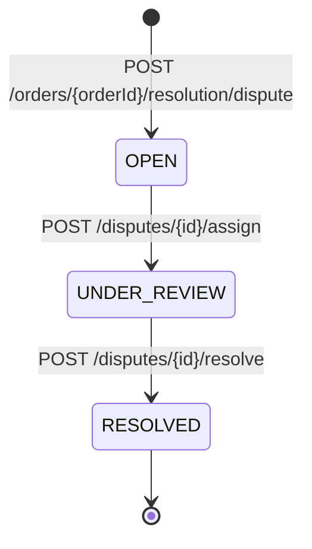
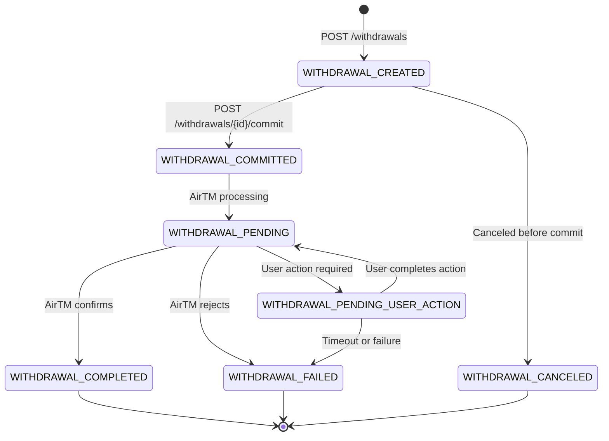
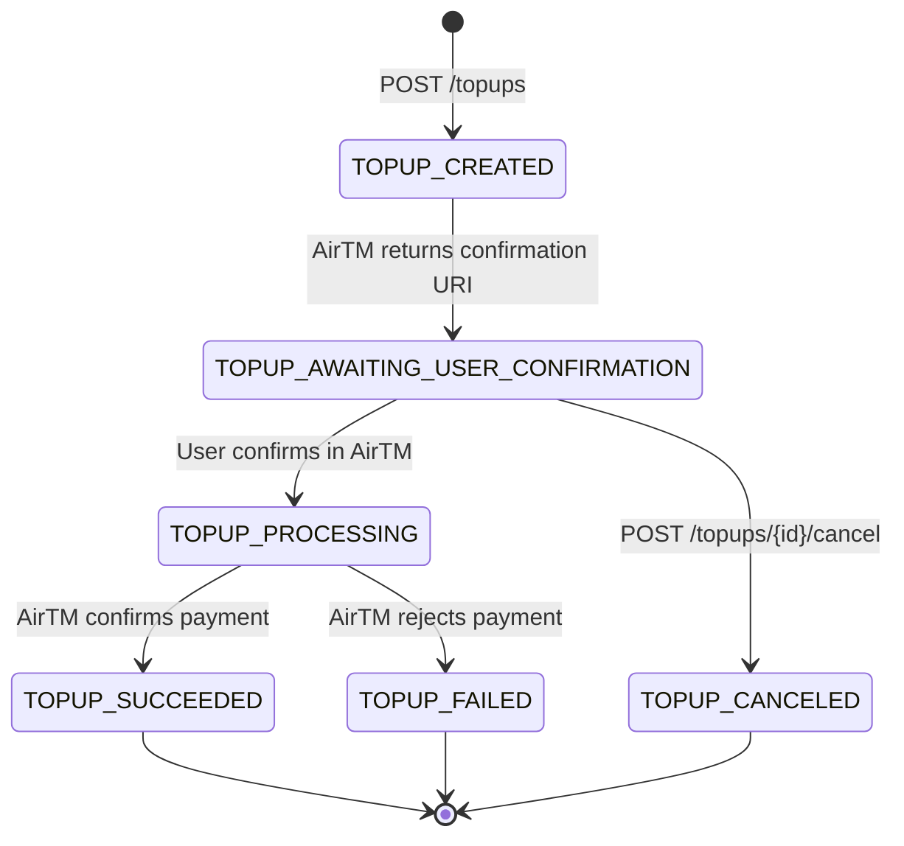
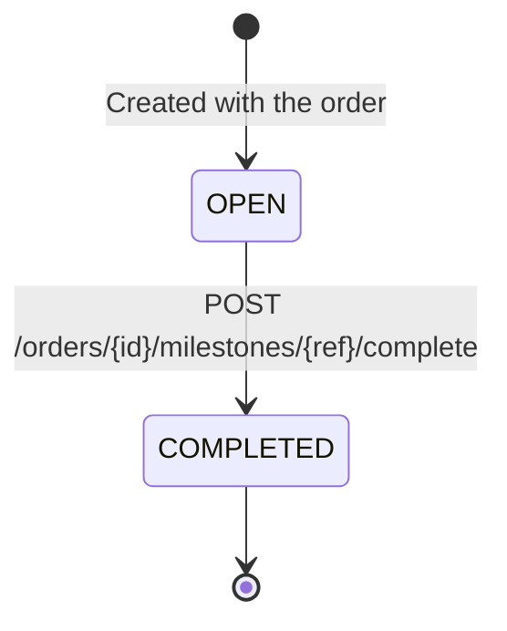

Every OFFER-HUB resource that moves through a lifecycle is backed by an explicit state machine. Orders, escrows, disputes, withdrawals, top-ups and milestones each have a fixed set of states and a fixed set of allowed edges between them — nothing else is reachable. This page is the single reference for those transitions.

<Callout type="note">
  The transition tables on this page are transcribed from the orchestrator's shared enums in `packages/shared/src/enums/`, not from the guides. If a table here disagrees with the code, the code wins — and this page is the bug.
</Callout>

<Callout type="tip">
  New here? Read [Data Model](/docs/guide/data-model) first for the tables behind these states, then [Orchestrator](/docs/guide/orchestrator) for how the engine drives them.
</Callout>

## How Enforcement Works

Each machine is declared as a transition map and wrapped in a `StateMachine<T>` helper (`packages/shared/src/utils/state-machine.ts`):

```typescript
const ORDER_TRANSITIONS: Record<OrderStatus, OrderStatus[]> = {
  ORDER_CREATED: ['FUNDS_RESERVED', 'CLOSED'],
  // ...
  CLOSED: [],
};
```

Every service calls into the helper rather than comparing statuses by hand. `assertTransition` throws when an edge does not exist, `canTransition` returns a boolean, and `isTerminalState` reports states with no outgoing edges. The five `StateMachine` singletons are exported as `OrderStateMachine`, `EscrowStateMachine`, `DisputeStateMachine`, `WithdrawalStateMachine` and `TopUpStateMachine`.

## Domain Overview

| Domain | State enum | States | Terminal states |
|--------|-----------|--------|-----------------|
| Order | `OrderStatus` | 12 | `CLOSED` |
| Escrow | `EscrowStatus` | 9 | `RELEASED`, `REFUNDED` |
| Dispute | `DisputeStatus` | 3 | `RESOLVED` |
| Withdrawal | `WithdrawalStatus` | 7 | `WITHDRAWAL_COMPLETED`, `WITHDRAWAL_FAILED`, `WITHDRAWAL_CANCELED` |
| Top-up | `TopUpStatus` | 6 | `TOPUP_SUCCEEDED`, `TOPUP_FAILED`, `TOPUP_CANCELED` |
| Milestone | `MilestoneStatus` | 2 | `COMPLETED` |

---

## Order State Machine

The order is the lifecycle root: it owns the funds reservation, the escrow, the milestones and the dispute. Every state below is a real `OrderStatus` value in `packages/shared/src/enums/order-status.enum.ts`.

<OrderStateMachineDiagram />

### States

| State | Description |
|-------|-------------|
| `ORDER_CREATED` | Order created off-chain, no funds reserved |
| `FUNDS_RESERVED` | Buyer balance reserved (logical hold) |
| `ESCROW_CREATING` | Creating the escrow contract in Trustless Work |
| `ESCROW_FUNDING` | Funding the escrow from the reserved balance |
| `ESCROW_FUNDED` | Escrow funded, funds locked on-chain |
| `IN_PROGRESS` | Work in progress — the only state that accepts release, refund or dispute |
| `RELEASE_REQUESTED` | Release requested for the seller |
| `RELEASED` | Funds released to the seller |
| `REFUND_REQUESTED` | Refund requested for the buyer |
| `REFUNDED` | Funds returned to the buyer |
| `DISPUTED` | Dispute opened, flow frozen |
| `CLOSED` | Order completed |

### Valid Transitions

| From | To | Triggered by |
|------|----|--------------|
| `ORDER_CREATED` | `FUNDS_RESERVED` | `POST /orders/{id}/reserve` |
| `ORDER_CREATED` | `CLOSED` | `POST /orders/{id}/cancel` |
| `FUNDS_RESERVED` | `ESCROW_CREATING` | `POST /orders/{id}/escrow` |
| `FUNDS_RESERVED` | `CLOSED` | `POST /orders/{id}/cancel` |
| `ESCROW_CREATING` | `ESCROW_FUNDING` | Escrow contract created in Trustless Work |
| `ESCROW_FUNDING` | `ESCROW_FUNDED` | `POST /orders/{id}/escrow/fund` |
| `ESCROW_FUNDING` | `IN_PROGRESS` | Declared in the transition map, not reached by the current endpoints |
| `ESCROW_FUNDED` | `IN_PROGRESS` | Work starts |
| `IN_PROGRESS` | `RELEASE_REQUESTED` | `POST /orders/{orderId}/resolution/release` |
| `IN_PROGRESS` | `REFUND_REQUESTED` | `POST /orders/{orderId}/resolution/refund` |
| `IN_PROGRESS` | `DISPUTED` | `POST /orders/{orderId}/resolution/dispute` |
| `RELEASE_REQUESTED` | `RELEASED` | Trustless Work confirms the release |
| `REFUND_REQUESTED` | `REFUNDED` | Trustless Work confirms the refund |
| `DISPUTED` | `RELEASED` | Dispute resolved with `FULL_RELEASE` or `SPLIT` |
| `DISPUTED` | `REFUNDED` | Dispute resolved with `FULL_REFUND` or `SPLIT` |
| `DISPUTED` | `RELEASE_REQUESTED` | Declared in the transition map, not reached by the current endpoints |
| `DISPUTED` | `REFUND_REQUESTED` | Declared in the transition map, not reached by the current endpoints |
| `RELEASED` | `CLOSED` | Cleanup |
| `REFUNDED` | `CLOSED` | Cleanup |

<Callout type="note">
  Three rows above are declared in `ORDER_TRANSITIONS` but no endpoint drives them today. They are documented anyway so the table matches the code exactly — do not build against them.
</Callout>

<Callout type="warning">
  Cancellation is only possible from `ORDER_CREATED` and `FUNDS_RESERVED` — the enum exports this explicitly as `CANCELLABLE_ORDER_STATES`. After the escrow is created the only exits are release, refund, or a dispute.
</Callout>

---

## Escrow State Machine

The escrow mirrors the Trustless Work contract on Stellar. Its states are stored locally in `escrows.status` and reconciled against the provider by the reconciliation worker.

<EscrowStateMachineDiagram />

### States

| State | Description |
|-------|-------------|
| `CREATING` | Creating the contract in Trustless Work |
| `CREATED` | Contract created, not yet funded |
| `FUNDING` | Funding the contract |
| `FUNDED` | Funds locked in the contract |
| `RELEASING` | Releasing funds to the seller |
| `RELEASED` | Funds released |
| `REFUNDING` | Returning funds to the buyer |
| `REFUNDED` | Funds returned |
| `DISPUTED` | Active dispute against the escrow |

### Valid Transitions

| From | To |
|------|----|
| `CREATING` | `CREATED` |
| `CREATED` | `FUNDING` |
| `FUNDING` | `FUNDED` |
| `FUNDED` | `RELEASING`, `REFUNDING`, `DISPUTED` |
| `RELEASING` | `RELEASED` |
| `REFUNDING` | `REFUNDED` |
| `DISPUTED` | `RELEASED`, `REFUNDED` |

Terminal states are `RELEASED` and `REFUNDED`. `DISPUTED` is **not** terminal — a dispute is a pause, and resolution pushes the escrow to one of the two terminal states.

<Callout type="note">
  Release and refund both require the escrow to be in `FUNDED`; any other escrow status is rejected with `INVALID_STATE` and a message naming the current status. Opening a dispute is guarded on the *order* being `IN_PROGRESS`, and it moves the escrow to `DISPUTED` in the same transaction. Escrow-specific provider failures use a separate code, `ESCROW_INVALID_STATE`.
</Callout>

---

## Dispute State Machine

A dispute freezes its parent order in `DISPUTED` until support resolves it. Resolution decisions are `FULL_RELEASE`, `FULL_REFUND` and `SPLIT`.



### States

| State | Description |
|-------|-------------|
| `OPEN` | Dispute opened, awaiting review |
| `UNDER_REVIEW` | Assigned to a support agent |
| `RESOLVED` | Decision applied to the order and the escrow |

### Valid Transitions

| From | To | Triggered by |
|------|----|--------------|
| `OPEN` | `UNDER_REVIEW` | `POST /disputes/{id}/assign` |
| `UNDER_REVIEW` | `RESOLVED` | `POST /disputes/{id}/resolve` |

`RESOLVED` is the only terminal state. There is no path back out of it, and there is no transition that skips `UNDER_REVIEW`.

### Resolution Rules

- A `SPLIT` decision requires both `releaseAmount` and `refundAmount`, and the two amounts must sum exactly to the order amount — anything else returns `INVALID_AMOUNT`.
- Resolving a dispute drives the order and the escrow in the same operation: `FULL_RELEASE` and `SPLIT` end at order `RELEASED` / escrow `RELEASED`, `FULL_REFUND` ends at order `REFUNDED` / escrow `REFUNDED`.
- One active dispute per order. A second attempt returns `DISPUTE_ALREADY_OPEN`, not `INVALID_STATE`.

---

## Withdrawal State Machine

Withdrawals cover both off-ramps: an AirTM payout (`destinationType: bank`) and a crypto-native Stellar send (`destinationType: crypto`). AirTM payout statuses are mapped one-to-one onto these states by `mapAirtmPayoutStatus`.



### States

| State | Description |
|-------|-------------|
| `WITHDRAWAL_CREATED` | Withdrawal recorded, waiting for commit |
| `WITHDRAWAL_COMMITTED` | Committed to the provider, waiting for processing |
| `WITHDRAWAL_PENDING` | Provider processing the payout |
| `WITHDRAWAL_PENDING_USER_ACTION` | Blocked on the user (KYC, verification) |
| `WITHDRAWAL_COMPLETED` | Payout succeeded |
| `WITHDRAWAL_FAILED` | Payout failed |
| `WITHDRAWAL_CANCELED` | Canceled before commit |

### Valid Transitions

| From | To | Triggered by |
|------|----|--------------|
| `WITHDRAWAL_CREATED` | `WITHDRAWAL_COMMITTED` | `POST /withdrawals/{id}/commit` |
| `WITHDRAWAL_CREATED` | `WITHDRAWAL_CANCELED` | Provider cancellation, before commit |
| `WITHDRAWAL_COMMITTED` | `WITHDRAWAL_PENDING` | AirTM webhook or refresh |
| `WITHDRAWAL_PENDING` | `WITHDRAWAL_PENDING_USER_ACTION` | Provider requires user action |
| `WITHDRAWAL_PENDING` | `WITHDRAWAL_COMPLETED` | AirTM confirms the payout |
| `WITHDRAWAL_PENDING` | `WITHDRAWAL_FAILED` | AirTM rejects the payout |
| `WITHDRAWAL_PENDING_USER_ACTION` | `WITHDRAWAL_PENDING` | User completes the required action |
| `WITHDRAWAL_PENDING_USER_ACTION` | `WITHDRAWAL_FAILED` | Timeout or unrecoverable failure |

<Callout type="note">
  Committing a withdrawal that is not in `WITHDRAWAL_CREATED` returns `WITHDRAWAL_NOT_COMMITTABLE` (HTTP 409), not the generic `INVALID_STATE`. The `canCommitPayout` helper restricts commits to `WITHDRAWAL_CREATED`.
</Callout>

---

## Top-up State Machine

A top-up is the on-ramp. `POST /topups` records the intent in `TOPUP_CREATED`, the provider generates a confirmation URI, and the user's payment is confirmed out of band. AirTM payin statuses are mapped one-to-one by `mapAirtmPayinStatus`.



### States

| State | Description |
|-------|-------------|
| `TOPUP_CREATED` | Top-up recorded, waiting for the confirmation URI |
| `TOPUP_AWAITING_USER_CONFIRMATION` | URI issued, waiting for the user in AirTM |
| `TOPUP_PROCESSING` | User confirmed, provider processing |
| `TOPUP_SUCCEEDED` | Payment succeeded, balance credited |
| `TOPUP_FAILED` | Payment failed — see `failureReason` in `metadata` |
| `TOPUP_CANCELED` | Canceled by the user or timed out |

### Valid Transitions

| From | To | Triggered by |
|------|----|--------------|
| `TOPUP_CREATED` | `TOPUP_AWAITING_USER_CONFIRMATION` | Confirmation URI generated |
| `TOPUP_AWAITING_USER_CONFIRMATION` | `TOPUP_PROCESSING` | User confirms in AirTM |
| `TOPUP_AWAITING_USER_CONFIRMATION` | `TOPUP_CANCELED` | `POST /topups/{id}/cancel` |
| `TOPUP_PROCESSING` | `TOPUP_SUCCEEDED` | AirTM confirms payment |
| `TOPUP_PROCESSING` | `TOPUP_FAILED` | AirTM rejects payment |

Cancellation is only accepted from `TOPUP_AWAITING_USER_CONFIRMATION`. Any other current status returns `INVALID_STATE` with `allowedStatuses` naming the single permitted one.

---

## Milestone State Machine

Milestones are the optional sub-deliverables of an order. They are created together with the order (`POST /orders` with a `milestones` array) and completed individually.



### States

| State | Description |
|-------|-------------|
| `OPEN` | Milestone created, work not yet acknowledged |
| `COMPLETED` | Milestone marked complete and an `escrow.milestone_completed` event emitted |

### Valid Transitions

| From | To | Triggered by |
|------|----|--------------|
| `OPEN` | `COMPLETED` | `POST /orders/{id}/milestones/{ref}/complete` |

`COMPLETED` is the only terminal state and there is no reopen path — a milestone is a one-way latch. Completing a milestone emits an `escrow.milestone_completed` event carrying the running completion percentage of the order.

### Milestone Rules

- **Parent order must be `IN_PROGRESS`.** Completion is rejected in every other order state, with `INVALID_STATE`.
- **One-way only.** Completing an already-completed milestone returns `INVALID_STATE` with the message `Milestone {ref} is already completed`.
- **Amounts must reconcile.** When milestones are supplied at order creation, their amounts must sum exactly to the order amount; otherwise the order is rejected with `INVALID_AMOUNT` before any state is written.
- **Escrow type follows milestones.** Creating an order with a `milestones` array provisions a `multi-release` Trustless Work contract; an order without milestones provisions a `single-release` contract.

---

## State Transition Errors

`INVALID_STATE` is the single error code for "the resource is not in a state where this operation makes sense". It is declared in `packages/shared/src/constants/error-codes.ts` with the default message `Invalid state transition` and mapped to **HTTP 409**.

Most rejections come from a domain guard that names the current state in the message:

```json
{
  "error": {
    "code": "INVALID_STATE",
    "message": "Cannot reserve funds order ord_abc123 in state FUNDS_RESERVED"
  }
}
```

Guards that need to be more specific attach a `details` object. The top-up cancel guard, for example, returns the current status and the single status it would have accepted:

```json
{
  "error": {
    "code": "INVALID_STATE",
    "message": "Cannot cancel top-up in status TOPUP_PROCESSING",
    "details": {
      "currentStatus": "TOPUP_PROCESSING",
      "allowedStatuses": ["TOPUP_AWAITING_USER_CONFIRMATION"]
    }
  }
}
```

The machine helper itself carries a richer payload — `currentState`, `targetState` and `allowedTransitions` — but services call it only *after* the domain guard has already rejected the illegal call, so in practice you will not see that shape in a response.

### Where You Will See It

| Operation | Required state | Code on violation |
|-----------|----------------|-------------------|
| `POST /orders/{id}/reserve` | `ORDER_CREATED` | `INVALID_STATE` |
| `POST /orders/{id}/cancel` | `ORDER_CREATED` or `FUNDS_RESERVED` | `INVALID_STATE` |
| `POST /orders/{id}/escrow` | `FUNDS_RESERVED` | `INVALID_STATE`, or `ESCROW_ALREADY_EXISTS` if one exists |
| `POST /orders/{id}/escrow/fund` | Order `ESCROW_FUNDING`, escrow `CREATED` | `INVALID_STATE` |
| Release, refund, dispute | Order `IN_PROGRESS` | `INVALID_STATE` |
| `POST /orders/{id}/milestones/{ref}/complete` | Order `IN_PROGRESS` and milestone `OPEN` | `INVALID_STATE` |
| `POST /disputes/{id}/assign` | Dispute `OPEN` | `INVALID_STATE` |
| `POST /disputes/{id}/resolve` | Dispute `UNDER_REVIEW` | `INVALID_STATE` |
| `POST /withdrawals/{id}/commit` | `WITHDRAWAL_CREATED` | `WITHDRAWAL_NOT_COMMITTABLE` |
| `POST /topups/{id}/cancel` | `TOPUP_AWAITING_USER_CONFIRMATION` | `INVALID_STATE` |

<Callout type="warning">
  `INVALID_STATE` is a client error and **never** means your retry will succeed. Re-read the resource's `status`, pick an edge that exists in the tables above, and only then retry. Retrying the same call in the same state returns the same error.
</Callout>

<Callout type="note">
  Treat `error.code`, not the HTTP status, as the contract. `INVALID_STATE` defaults to 409, but several domain guards — order, dispute and resolution — raise Nest's `BadRequestException` while reporting the same code, so those responses come back as HTTP 400. Branch on `error.code`.
</Callout>

### Recovering

1. `GET` the resource and read its current `status`.
2. Look the state up in the table for that domain above and find the edge that leads to the state you need.
3. If the edge does not exist from the current state, the operation is genuinely unavailable — for example, an order in `DISPUTED` cannot accept a second dispute, and a closed order accepts nothing at all.

---

## Related Guides

- [Data Model](/docs/guide/data-model) — the tables and enums behind these states, and the ID prefixes on every resource
- [Orders Guide](/docs/guide/orders) — the order lifecycle end to end
- [Escrow Guide](/docs/guide/escrow) — how the escrow contract maps to these states
- [Disputes Guide](/docs/guide/disputes) — opening, assigning and resolving disputes
- [Deposits Guide](/docs/guide/deposits) — the top-up flow
- [Withdrawals Guide](/docs/guide/withdrawals) — the withdrawal flow
- [API Reference](/docs/api-reference/overview) — authentication, envelopes and error format
