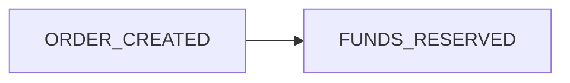
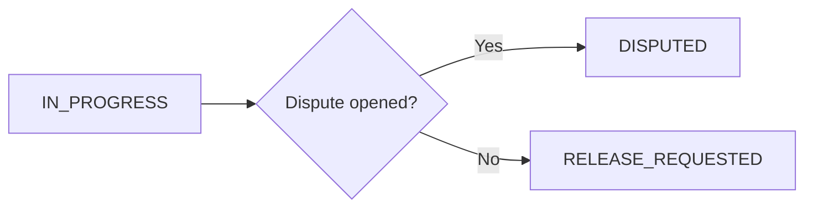
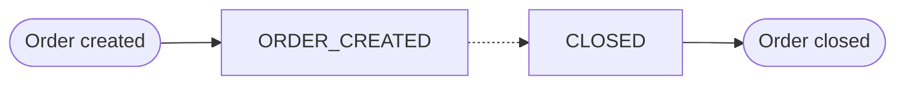
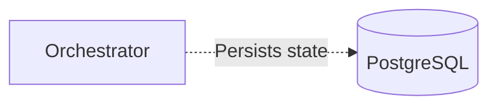
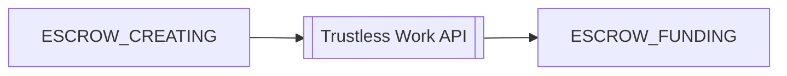
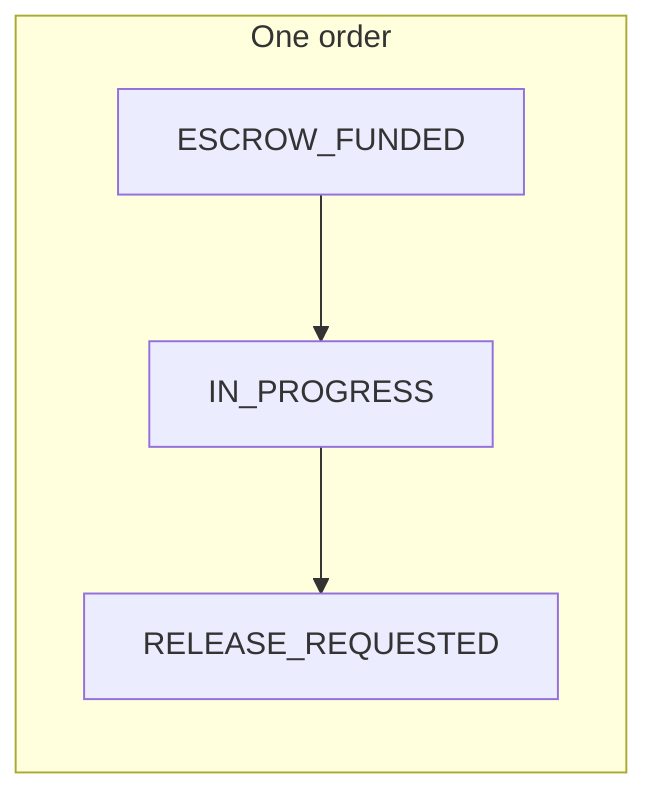

<Callout variant="warning">
  This page is for OFFER-HUB contributors working on the documentation site itself. It is not part of
  the public marketplace-integration guidance for teams consuming the Orchestrator API or SDK.
</Callout>

This guide documents the OFFER-HUB design system, including colors, typography, and component styling for both light and dark modes.

## API Schema Components

Use `ParamTable` for request parameters and `ResponseSchema` for response fields. Both components use the theme tokens and keep wide tables inside a labelled, keyboard-focusable scroll region on small screens. Nested fields start expanded and can be collapsed; field metadata supports defaults, enums, nullable values, and deprecation notes.

The example below is reviewed against the checked-in Orchestrator contract at `public/openapi.json`: the `/balances` operation (`get-user-balances`) and its response example. In the orchestrator source, keep the corresponding controller and DTO references alongside the contract when updating a schema page.

<ParamTable
  label="List transactions query parameters"
  fields={[
    { name: "page", type: "number", description: "Page number.", defaultValue: 1 },
    { name: "limit", type: "number", description: "Results per page (maximum 100).", defaultValue: 20 },
    { name: "currency", type: "string", description: "Filter by currency.", enum: ["USD", "XLM", "USDC"], nullable: true },
  ]}
/>

<ResponseSchema
  fields={[
    { name: "code", type: "number", required: true, description: "HTTP-style response code." },
    { name: "type", type: "string", required: true, description: "Response classification.", enum: ["success", "error"] },
    { name: "ok", type: "boolean", required: true, description: "Whether the request succeeded." },
    { name: "message", type: "string", required: true, description: "Human-readable result message." },
    {
      name: "data",
      type: "object",
      required: true,
      description: "Payload returned by the balances controller.",
      children: [
        {
          name: "balances",
          type: "array",
          required: true,
          description: "Available and held balances grouped by currency.",
          children: [
            { name: "currency", type: "string", required: true, description: "Currency code." },
            { name: "available", type: "number", required: true, description: "Spendable balance." },
            { name: "held", type: "number", required: true, description: "Reserved balance." },
          ],
        },
      ],
    },
  ]}
  example={{ code: 200, type: "success", ok: true, message: "Balances retrieved", data: { balances: [{ currency: "USD", available: 1250, held: 200 }] } }}
/>

## Color System

OFFER-HUB uses CSS variables for theme-aware colors. All colors automatically adapt when switching between light and dark modes.

### Background Colors

| Token | Light Mode | Dark Mode | Usage |
|-------|------------|-----------|-------|
| `--color-bg-base` | `#F1F3F7` | `#1a1a2e` | Page background |
| `--color-bg-elevated` | `#ffffff` | `#25253d` | Cards, modals, elevated surfaces |
| `--color-bg-sunken` | `#e8eaef` | `#12121f` | Inset areas, input backgrounds |

### Text Colors

| Token | Light Mode | Dark Mode | Usage |
|-------|------------|-----------|-------|
| `--color-text-primary` | `#19213D` | `#f1f3f7` | Headings, primary text |
| `--color-text-secondary` | `#6D758F` | `#a0a6b8` | Body text, descriptions |
| `--color-text-muted` | `#9ca3af` | `#6D758F` | Placeholder text, hints |

### Brand Colors

| Token | Light Mode | Dark Mode | Usage |
|-------|------------|-----------|-------|
| `--color-primary` | `#149A9B` | `#1fb8b9` | Primary buttons, links, accents |
| `--color-primary-hover` | `#0d7377` | `#25d4d5` | Primary hover states |
| `--color-secondary` | `#002333` | `#002333` | Secondary elements |
| `--color-accent` | `#15949C` | `#15949C` | Accent highlights |

### Semantic Colors

| Token | Light Mode | Dark Mode | Usage |
|-------|------------|-----------|-------|
| `--color-success` | `#16a34a` | `#16a34a` | Success states |
| `--color-warning` | `#d97706` | `#d97706` | Warning states |
| `--color-error` | `#FF0000` | `#FF0000` | Error states |

### Shadow Colors (Neumorphic)

| Token | Light Mode | Dark Mode | Usage |
|-------|------------|-----------|-------|
| `--shadow-dark` | `#d1d5db` | `#0f0f1a` | Dark shadow in neumorphic effects |
| `--shadow-light` | `#ffffff` | `#252540` | Light shadow in neumorphic effects |

### Border Colors

| Token | Light Mode | Dark Mode | Usage |
|-------|------------|-----------|-------|
| `--color-border` | `#d1d5db` | `#3d3d5c` | Borders, dividers |

---

## Tailwind Utility Classes

Use these Tailwind classes for theme-aware styling:

### Backgrounds

```jsx
// Page background
<div className="bg-bg-base" />

// Card/elevated surface
<div className="bg-bg-elevated" />

// Sunken/inset area
<div className="bg-bg-sunken" />
```

### Text

```jsx
// Primary text (headings)
<h1 className="text-content-primary" />

// Secondary text (body)
<p className="text-content-secondary" />

// Muted text (hints)
<span className="text-content-muted" />
```

### Brand Colors

```jsx
// Primary color
<button className="bg-theme-primary hover:bg-theme-primary-hover" />

// Accent color
<span className="text-theme-accent" />
```

### Neumorphic Shadows

```jsx
// Raised surface
<div className="shadow-neu-raised" />

// Small raised surface
<div className="shadow-neu-raised-sm" />

// Sunken/pressed surface
<div className="shadow-neu-sunken" />

// Subtle sunken
<div className="shadow-neu-sunken-subtle" />
```

### Borders

```jsx
<div className="border border-theme-border" />
```

---

## Typography

### Font Family

OFFER-HUB uses **Inter** as the primary font:

```css
font-family: var(--font-inter), Roboto, Outfit, sans-serif;
```

### Font Weights

| Weight | Class | Usage |
|--------|-------|-------|
| 400 | `font-normal` | Body text |
| 500 | `font-medium` | Emphasis, labels |
| 700 | `font-bold` | Headings, buttons |
| 900 | `font-black` | Hero titles |

### Text Sizes

| Size | Class | Usage |
|------|-------|-------|
| 12px | `text-xs` | Small labels |
| 13px | `text-[13px]` | Nav links |
| 14px | `text-sm` | Body text, buttons |
| 16px | `text-base` | Default body |
| 18-24px | `text-lg` to `text-2xl` | Subheadings |
| 32-48px | `text-3xl` to `text-5xl` | Section titles |
| 56-72px | `text-6xl` to `text-7xl` | Hero titles |

---

## Component Styling

### Buttons

#### Primary Button (Neumorphic)

```jsx
<button className="btn-neumorphic-primary px-6 py-2 rounded-full text-sm font-semibold">
  Button Text
</button>
```

#### Secondary Button (Neumorphic)

```jsx
<button className="btn-neumorphic-secondary px-6 py-2 rounded-full text-sm font-semibold">
  Button Text
</button>
```

### Cards

```jsx
<div className="bg-bg-elevated shadow-neu-raised rounded-2xl p-6">
  <h3 className="text-content-primary font-bold">Card Title</h3>
  <p className="text-content-secondary">Card description</p>
</div>
```

### Inputs

```jsx
<input
  type="text"
  className="bg-bg-sunken shadow-neu-sunken-subtle rounded-xl px-4 py-3 text-content-primary placeholder:text-content-muted border-none outline-none"
  placeholder="Enter text..."
/>
```

---

## Diagram System

All generated diagrams (Mermaid today — the same token contract is designed to carry over to a future static/offline pipeline) share one neumorphic theme module: `src/lib/diagram-theme.ts`. It reads colors directly from the CSS custom properties documented above — never hardcoded hex values — so every diagram matches the current site in both light and dark mode automatically, with no per-diagram theme code.

### How it works

- `readDiagramColorTokens()` reads `--color-bg-elevated`, `--color-bg-sunken`, `--color-text-primary`, `--color-text-secondary`, `--color-border`, `--shadow-dark`, and `--shadow-light` from whichever scope (`:root` or `.dark`) is active.
- `getMermaidThemeVariables()` maps those tokens onto Mermaid's `themeVariables` (node fill, text, line color, cluster background). Node and cluster borders use the neutral `--color-border` token — never `--color-primary` — so diagram structure reads through soft shadow depth, not a colored outline.
- `getNeumorphicDiagramCSS()` applies the same dual drop-shadow used by `shadow-neu-raised` (dark shadow bottom-right, light highlight top-left — the 145° light source from `docs/design/neumorphism.md`) directly to every node shape, via Mermaid's `themeCSS` hook.
- `src/components/shared/MermaidDiagram.tsx` is the single rendering component; `src/components/docs/MermaidDiagram.tsx` and `src/components/architecture/MermaidDiagram.tsx` are thin re-exports of it. Every fenced `mermaid` code block in MDX renders through it automatically via `src/components/docs/mdx-components.tsx`, so it already produces a correct light and a correct dark rendering of each diagram — no separate `-light`/`-dark` source files to maintain until the static diagram pipeline (tracked separately) lands.

### Accessibility

- Node and edge labels use `--color-text-primary`, documented in `docs/design/color-palette.md` at 12.5:1 contrast against `--color-bg-elevated` — well past the 4.5:1 WCAG AA requirement for text.
- Edges (`lineColor`) use `--color-text-secondary`, documented at 4.8:1 against the base background — past the 3:1 AA requirement for non-text graphical elements.
- No diagram hardcodes a color or uses a `border-l-4`-style accent bar. Contribute new diagram styling through `diagram-theme.ts` only.

### Node Type Reference

Every shape below renders through the shared theme. State names are taken from the Orchestrator's real order lifecycle (`docs/architecture/state-machines.md`, "Order States", in the `OFFER-HUB/OFFER-HUB` repo) instead of placeholder labels.

#### Process



#### Decision



#### Start / End



#### Database / Store



#### Subroutine (external call)



#### Cluster



---

## Z-Index Scale

| Value | Usage |
|-------|-------|
| `-1` | Background effects (dot grid) |
| `0` | Default content |
| `10` | Elevated cards |
| `50` | Sticky elements |
| `100` | Dropdowns |
| `499` | Mobile menu backdrop |
| `500` | Navbar |
| `501` | Mobile menu panel |

<Callout type="warning">
  Ensure content cards have a higher z-index than background effects (like the dot grid) to prevent visual overlap.
</Callout>

---

## Dark Mode Implementation

### Using the Theme Toggle

The theme can be toggled using the `useTheme` hook:

```tsx
import { useTheme } from '@/components/providers/ThemeProvider';

function MyComponent() {
  const { resolvedTheme, toggleTheme } = useTheme();

  return (
    <button onClick={toggleTheme}>
      Current theme: {resolvedTheme}
    </button>
  );
}
```

### Theme Persistence

Theme preference is automatically saved to `localStorage` under the key `offer-hub-theme` and persists across sessions.

### System Preference

When set to "system", the theme automatically follows the user's OS preference and updates in real-time if changed.

---

## Migration Guide

When migrating components to support dark mode, replace hardcoded colors with theme-aware alternatives:

| Before (Hardcoded) | After (Theme-aware) |
|--------------------|---------------------|
| `bg-[#F1F3F7]` | `bg-bg-base` |
| `bg-white` | `bg-bg-elevated` |
| `text-[#19213D]` | `text-content-primary` |
| `text-[#6D758F]` | `text-content-secondary` |
| `text-[#149A9B]` | `text-theme-primary` |
| `border-[#d1d5db]` | `border-theme-border` |
| `style={{ background: "#F1F3F7" }}` | `className="bg-bg-base"` |
| `style={{ color: "#19213D" }}` | `className="text-content-primary"` |

<Callout type="note">
  Always test components in both light and dark modes after migration to ensure proper contrast and visibility.
</Callout>
